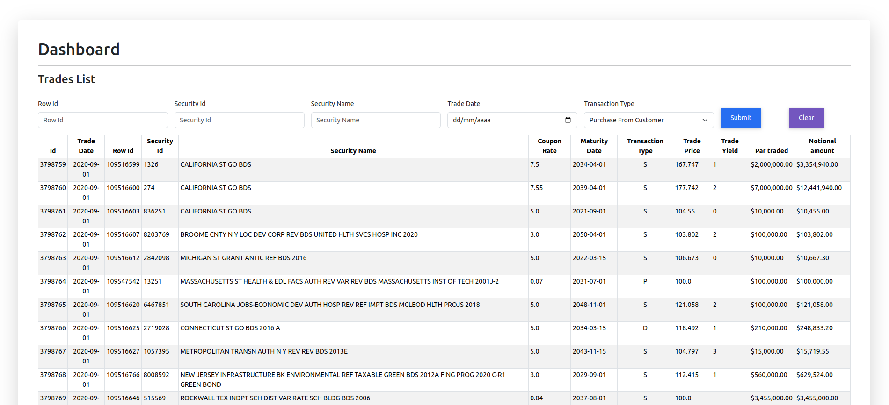

# maritime_capital_project

This is a README file for the maritime_capital_project.

## Installation

To install the project, follow these steps:

1. Clone the repository:

   ```bash
   git clone https://github.com/andersonav91/maritime_capital_project

2. Enter to the project:

   ```bash
   cd maritime_capital_project

3. Install the project and dependencies and start it:

   ```bash
   ./install.rb

If you encounter any issues during the installation process, please try running the commands manually. Here are the steps you can take:

- Check if all dependencies are installed.
- Ensure that the necessary permissions are set for the installation script.
- Verify that the environment is correctly configured.

## Technology Stack
This project utilizes the following technologies:

- SQL: The project uses SQL for database management.
- Bootstrap: Bootstrap is used for styling and front-end components.
- Rails 7: The project is built using Ruby on Rails version 7.

## Tested Environment

This project has been tested on Ubuntu.

## Some Screenshots




Developed by Anderson Alvarez Vásquez (andersonav91@gmail.com).